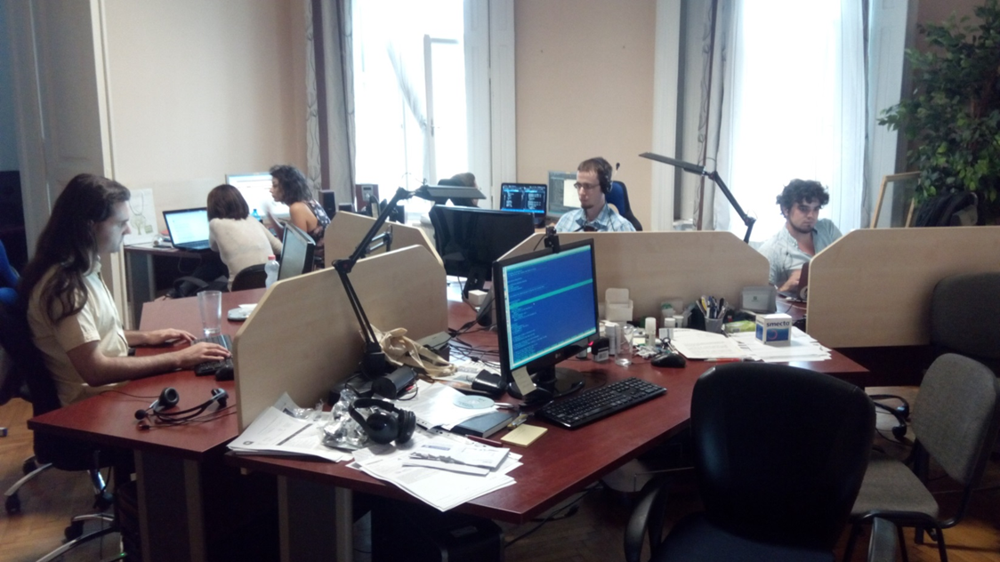

- title : Introduction to WebSharper
- author : Adam Granicz
- theme : night
- transition : default

***

## Introduction to  [WebSharper](https://github.com/intellifactory/websharper)

Adam Granicz, [IntelliFactory](http://intellifactory.com)  
[@granicz](https://twitter.com/granicz) | [intellifactory.com](http://intellifactory.com) | [websharper.com](http://websharper.com)

***

### IntelliFactory

---

 * Headquarter in Budapest, Hungary
 * 6 developers, 1 office manager, 1-2 interns
 * Founded in 2004, the first F# company

---

#### F# **custom development**

 * 280+ F# source repositories, [~60 open source](http://github.com/IntelliFactory)
 * One of the largest F# code bases around
 * 30+ of commercial applications built

---

#### F# **consulting** and **trainings**

 * Onsite
 * Online (coming soon)

---

#### We create **web** and **cloud technologies** for developers

 * [WebSharper stack](http://websharper.com) (~50 libraries)
 * [CloudSharper](http://cloudsharper.com)
 * CloudSharper-based applications

---

#### **Research**

 * Functional and reactive programming
   * UI.Next
 * Functional UI specification
   * Formlets, Flowlets, Piglets, UI.Next

***

### [WebSharper](http://websharper.com)

#### An F# web ecosystem

---

#### F# to JS compiler + Web abstractions

 * Pagelets
 * Sitelets
 * Formlets and flowlets
 * Piglets
 * UI.Next

---

#### Extensions

~50 extensions to various JavaScript libraries

 * Core: JQuery, EcmaScript, WebGL
 * Visualization: Google Visualization, D3, Raphael, Protovis, etc.
 * Charting: Highcharts, Chart.js, etc.
 * GIS: Google Maps, Bing Maps, Leaflet.js
 * Mobile: jQuery Mobile, Sencha Touch, Kendo Mobile
 * ...

---

#### New extensions

You can implement your own extension:

 * manually (via JavaScript inlines)
 * using [WIG](http://websharper.com/docs/wig)
 * importing TypeScript declarations

***

### [WebSharper Warp](https://github.com/IntelliFactory/websharper.warp)

#### A library for creating scripted and self-hosted client-server applications in F#.

> Warp is a set of shorthands to get started more easily with WebSharper.

---

### Installation

	Install-Package WebSharper.Warp

or if you use [paket](http://fsprojects.github.io/Paket)

	paket init
	paket add nuget WebSharper.Warp

---

### Hello World!

	open WebSharper
	
	let MyApp = Warp.Text "Hello world!"
	
	[<EntryPoint>]
	do Warp.RunAndWaitForInput(MyApp) |> ignore

---

### Single-Page Applications

	open WebSharper.Html.Server
	
	let MySite =
	    Warp.CreateSPA (fun ctx ->
	        [H1 [Text "Hello world!"]])
	
	[<EntryPoint>]
	do Warp.RunAndWaitForInput(MySite) |> ignore

---

### Multi-Page Applications

	type Endpoints =
	    | [<EndPoint "GET /">] Home
	    | [<EndPoint "GET /about">] About

	let MySite =
	    Warp.CreateApplication (fun ctx endpoint ->
	        match endpoint with
	        | Endpoints.Home ->
	            Warp.Page(...)
	        | Endpoints.About ->
	            Warp.Page(...)
	    )
	
	[<EntryPoint>]

	do Warp.RunAndWaitForInput(MySite) |> ignore
***

### Coding

***

### Coding 2

***

### Conclusions

F# is a great choice for web application developers.

WebSharper automates many of the typical web chores, and
makes development more robust, more concise, and more fun.

WebSharper Warp makes it easy to get started.

***

### Thanks for listening!

Get in touch!

Adam Granicz, [IntelliFactory](http://intellifactory.com)  
[@granicz](https://twitter.com/granicz) | [intellifactory.com](http://intellifactory.com) | [websharper.com](http://websharper.com)
